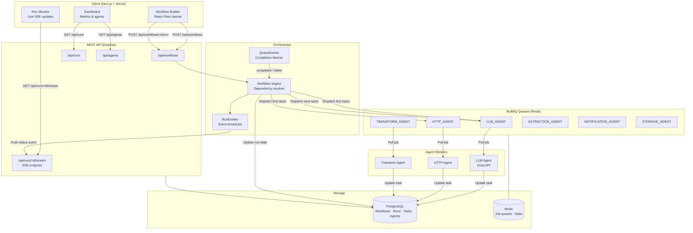

## Architecture

```mermaid
flowchart TB
    subgraph Client["Client (Next.js + Vercel)"]
        WB["Workflow Builder\nReact Flow canvas"]
        RM["Run Monitor\nLive SSE updates"]
        DB["Dashboard\nMetrics & agents"]
    end

    subgraph API["REST API (Express)"]
        WR["/api/workflows"]
        RR["/api/runs"]
        AR["/api/agents"]
        SSE["/api/runs/:id/stream\nSSE endpoint"]
    end

    subgraph Orchestrator["Orchestrator"]
        OC["Workflow engine\nDependency resolver"]
        QE["QueueEvents\nCompletion listener"]
        RE["RunEmitter\nEvent broadcast"]
    end

    subgraph Queues["BullMQ Queues (Redis)"]
        LQ["LLM_AGENT"]
        HQ["HTTP_AGENT"]
        TQ["TRANSFORM_AGENT"]
        EQ["EXTRACTION_AGENT"]
        NQ["NOTIFICATION_AGENT"]
        SQ["STORAGE_AGENT"]
    end

    subgraph Workers["Agent Workers"]
        LA["LLM Agent\nGroq API"]
        HA["HTTP Agent"]
        TA["Transform Agent"]
    end

    subgraph Storage["Storage"]
        PG[("PostgreSQL\nWorkflows · Runs · Tasks · Agents")]
        RD[("Redis\nJob queues · State")]
    end

    WB -->|"POST /api/workflows"| WR
    WB -->|"POST /api/workflows/:id/run"| WR
    RM -->|"GET /api/runs/:id/stream"| SSE
    DB -->|"GET /api/agents"| AR
    DB -->|"GET /api/runs"| RR

    WR --> OC
    OC -->|"Dispatch first tasks"| LQ
    OC -->|"Dispatch first tasks"| HQ
    QE -->|"completed / failed"| OC
    OC -->|"Dispatch next tasks"| LQ
    OC --> RE
    RE -->|"Push status event"| SSE

    LQ -->|"Pull job"| LA
    HQ -->|"Pull job"| HA
    TQ -->|"Pull job"| TA

    LA -->|"Update task"| PG
    HA -->|"Update task"| PG
    TA -->|"Update task"| PG

    OC -->|"Update run state"| PG
    API --> PG
    Queues --- RD
```
